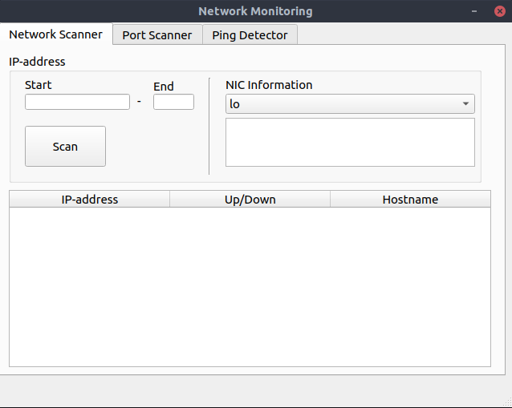

Netwerkscan
===========

Voor het uitvoeren van een netwerkscan kan je gebruik maken van de tab **Network Scanner**. Voer bij **Start** het IP
adres in en in **End** tot welk adres je wilt scannen. 

Bijvoorbeeld **Start** 192.168.1.0 **End** 150 het netwerk zal gescaned worden van adres 1 t/m 150. 

Wanneer de scan voltooid is zullen de IP adressen, host aan of uit en de hostname worden weergegeven in de tabel.

Om na te gaan op welk netwerk je bent aangesloten kun je gebruik maken van de **NIC information**. Selecteer je netwerkkaart via
het dropdown menu, de gegeves zullen in het veld eronde zichtbaar worden.

.. note::

   De netwerkscan zal worden uitgevoerd op de netwerkkaart waar de default gateway op is ingesteld. 

