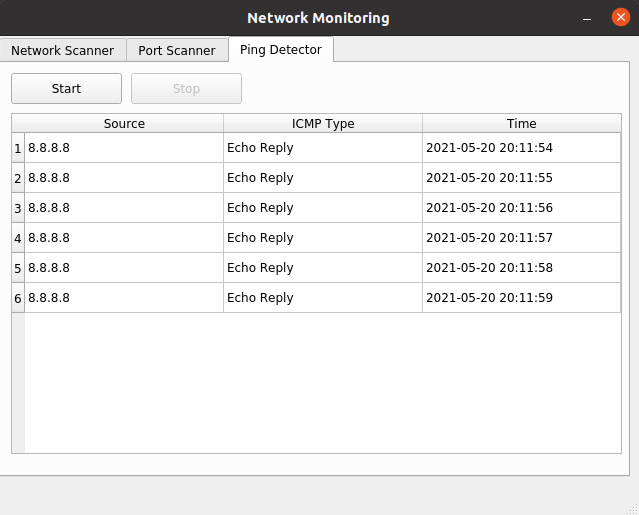

Ping Detector
=============

Deze ping detector kan verschillende ICMP pakketen onderscheppen. Er wordt op alle beschikbare netwerkkaarten geluisteren naar ICMP pakketen.

Om de detector te starten drukt men simpelweg op **Start**. Om de scan de stoppen drukt men op **Stop**

De volgende ICMP types worden ondersteund:
* Echo Reply (0)
* Destination Unreachable (3)
* Redirect (5)
* Echo (8)
* Router Advertisement (9)
* Router Selection (10)
* Time Exceeded (11)
* Parameter Problem (12)
* Timestamp (13)
* Timestamp Reply (14)
* Photuris (40)
* Extended Echo Request (42)
* Extended Echo Reply (43)

.. note::

Alle deprecated en reserved poorten volgens https://www.iana.org/assignments/icmp-parameters/icmp-parameters.xhtml worden niet ondersteund.

